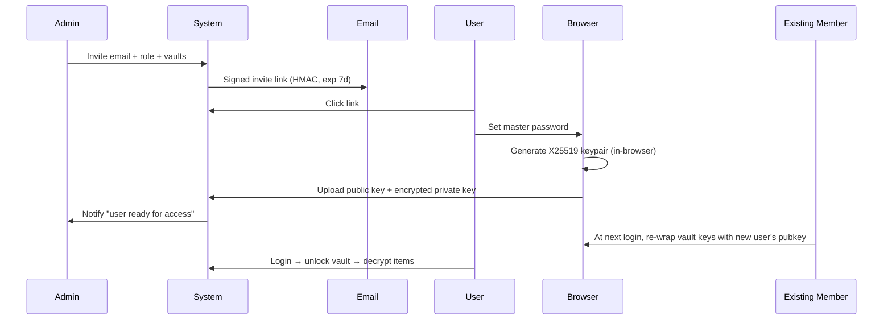

# 🔐 Woxa Secret Vault — Design Document

> 📌 **Companion to:** [README.md](./README.md) · [PHASES.md](./PHASES.md) · [prototype.html](./prototype.html)

---

## 📋 Properties

| | |
|---|---|
| 🏷 **Status** | 🟡 v0.2 · Draft for review |
| 📅 **Created** | 2026-05-12 |
| 📅 **Last updated** | 2026-05-12 (re-design from usage review) |
| 👤 **Owner** | ching@iux24.com |
| 🎯 **Audience** | Engineering, Security, Stakeholders |
| 🔒 **Sensitivity** | Internal |

---

## 📚 Table of Contents

**Part I — Product & Architecture**
1. [Vision & Goals](#1-vision--goals)
2. [Product Modes](#2-product-modes)
3. [User Roles & Access Hierarchy](#3-user-roles--access-hierarchy)
4. [Core Workflows](#4-core-workflows)
5. [Security Architecture](#5-security-architecture)
6. [Encryption Model](#6-encryption-model)
7. [Database Schema](#7-database-schema)
8. [UI / UX Design](#8-ui--ux-design)
9. [API Design (High-level)](#9-api-design-high-level)
10. [Tech Stack](#10-tech-stack)

**Part II — Lifecycle & Governance** *(NEW v0.2)*
11. [Granular Permissions Model](#11-granular-permissions-model)
12. [Password Rotation & Lifecycle](#12-password-rotation--lifecycle)
13. [Service Tokens & API Access](#13-service-tokens--api-access)
14. [Browser Extension Architecture](#14-browser-extension-architecture)
15. [Import & Export](#15-import--export)
16. [Break-Glass & Emergency Access](#16-break-glass--emergency-access)
17. [Auditor Role & Compliance Reports](#17-auditor-role--compliance-reports)
18. [Anomaly Detection & Alerts](#18-anomaly-detection--alerts)
19. [Permission Request Workflow](#19-permission-request-workflow)

**Part III — Risk & Compliance**
20. [Security Risks & Mitigations](#20-security-risks--mitigations)
21. [Compliance Considerations](#21-compliance-considerations)

---

> 💡 **What's new in v0.2**
> เพิ่ม Part II (sections 11-19) ตาม [usage review findings](./README.md):
> - 🔴 P0 gaps closed: Import (§15), Service Tokens (§13), Browser Ext (§14), Bulk Ops (in §11)
> - 🟠 P1 gaps closed: Rotation (§12), Permission Request (§19), Break-glass (§16), Auditor (§17), Anomaly (§18)
> - Granular permissions replace simple Editor/Viewer roles (§11)

---

## 1. Vision & Goals

### Problem
ทีมงานต้องการ share password / API key / SSH key / secure note ระหว่างกัน ปัจจุบันใช้ Slack DM, LINE, email, Google Doc ซึ่ง:
- ไม่ปลอดภัย (เก็บใน chat history, ค้นเจอใน search engine ภายใน)
- ไม่มี audit trail (ใครเห็น password ตอนไหน)
- ไม่มี expiration (รหัสที่ส่งเมื่อ 2 ปีที่แล้วยังเปิดเจอใน Slack)
- ไม่มี access control (ลบจากทีม = password ยังอยู่ในมือคนที่ออก)

### Solution
ระบบกลางที่:
1. **เก็บรหัสแบบ persistent** สำหรับทีมที่ต้องใช้ซ้ำ (เช่น AWS root, DB password)
2. **ส่งรหัสแบบ one-time** สำหรับคนนอก org (vendor, contractor)
3. **Zero-knowledge encryption** — server admin ก็อ่านไม่ได้
4. **Access control** — กำหนดสิทธิ์ระดับ vault / folder / item
5. **Audit log** ครบทุก action ที่กระทำกับ secret
6. **ใช้งานง่าย** — search Cmd+K, copy คลิกเดียว, autofill ผ่าน browser extension

### Success Metrics
- ทีม 20+ คน เลิกใช้ Slack ส่ง password ภายใน 3 เดือน
- 100% ของ production credentials อยู่ใน vault (ไม่อยู่ใน `.env` ที่ commit)
- Mean time to revoke = < 5 นาที (เมื่อคนออก org)
- Audit log ครอบคลุม 100% ของ secret access

---

## 2. Product Modes

ระบบมี **2 mode** ที่แยกกันแต่ใช้ infrastructure เดียว:

### 🏛 Vault Mode (Persistent)
สำหรับเก็บ secret ที่ใช้ซ้ำในทีม
- Login-based access (master password + 2FA)
- Folder/tag organization
- Version history, audit log
- Browser extension autofill

### 📤 Send Mode (Ephemeral)
สำหรับส่ง secret ครั้งเดียวให้คนนอก (ไม่ต้องมี account)
- Anonymous-friendly (URL + optional passphrase)
- Burn after read / time-limited
- Zero-knowledge always (key in URL fragment)
- Optional: lock to recipient email

**Cross-feature:** ใน Vault item detail มีปุ่ม **"Send one-time copy"** เพื่อ generate Send link จาก item ใน vault โดยอัตโนมัติ — audit log ผูก source item

---

## 3. User Roles & Access Hierarchy

### Hierarchy
```
Organization (e.g., "iux24")
└── Teams (DevOps, Marketing, Finance, …)
    └── Vaults (Production, Staging, Personal, Shared, …)
        └── Folders (AWS, Databases, Third-party, …)
            └── Items (Login, API Key, SSH, Note, Card, Identity)
```

### Org-level Roles
| Role | Description |
|---|---|
| **Owner** | สูงสุด: billing, transfer ownership, delete org |
| **Admin** | สร้าง team/vault, invite/remove member, ดู audit log ทุกคน |
| **Member** | ใช้งานปกติ ตาม vault ที่ได้รับสิทธิ์ |
| **Guest** | ภายนอก org ที่ได้รับ invite ให้เข้า vault เฉพาะ (e.g., contractor) |

#### Single-Owner Model (Owner > Admin > Member > Guest)
- **หนึ่ง Owner ต่อ workspace เท่านั้น** (single-owner invariant). คนที่ **สร้าง** workspace = Owner เสมอ
- Hierarchy แบบเข้ม: ผู้กระทำต้อง **strictly outrank** เป้าหมายถึงจะแก้ role/remove ได้
  - Admin **ห้าม** demote / remove / แก้ role ของ Owner หรือของ Admin คนอื่น (peer)
  - Admin จัดการได้เฉพาะ Member / Guest
- **เฉพาะ Owner** เท่านั้นที่: delete workspace, transfer ownership, จัดการ billing
- **เปลี่ยนเจ้าของ** ทำผ่าน `POST /workspace/transfer-ownership` เท่านั้น (atomic: เจ้าของเดิม → Admin, เป้าหมาย → Owner) — **ห้าม** set role=`owner` ตรงผ่าน `PATCH /members/:id` (validation reject)
- **บังคับ invariant 2 ชั้น**: (1) app-level atomic transaction, (2) DB partial unique index `org_members_single_owner_idx` บน `(org_id) WHERE role='owner'` (migration 0009) — กัน 2-owner ทั้งจาก race และ bug ในอนาคต

### Vault-level Roles
| Role | View | Use (copy/decrypt) | Edit | Share | Delete |
|---|---|---|---|---|---|
| **Manager** | ✅ | ✅ | ✅ | ✅ | ✅ |
| **Editor** | ✅ | ✅ | ✅ | ✅ | ❌ |
| **User** | ✅ | ✅ | ❌ | ❌ | ❌ |
| **Viewer** | ✅ (metadata only) | ❌ | ❌ | ❌ | ❌ |

> **Viewer** เห็นแต่ชื่อ item ว่ามีอยู่ — เปิดดูรหัสจริงไม่ได้ (สำหรับ auditor, manager)

### Principal Types (assignable to access)
1. **User** (specific email)
2. **Team** (group of users)
3. **Email domain** (e.g., `@iux24.com` ทั้งโดเมน — JIT provisioning)
4. **External email** (Guest access ชั่วคราว)

### Access Resolution (most specific wins)
```
Item-level override
  → Folder-level access
    → Vault-level access
      → Org-level role
```

---

## 4. Core Workflows

### 4.1 Onboarding ผู้ใช้ใหม่

#### 4.1.0 Post-auth: Create-or-Join Workspace (`/spaces`)
Flow หลักของ Phase A (single-Owner model):
```
Google SSO callback
  → (ถ้า user มี TOTP เปิดอยู่) /login/mfa : ต้องผ่าน 2FA ก่อน (app-level, AC-003.5)
       • callback ออก mfaToken ใส่ cookie `mfa_pending` (HttpOnly, SameSite=Lax, Max-Age=300) — ไม่ใส่ใน URL
       • ยังไม่ออก session cookie จนกว่า POST /auth/2fa/verify-login จะผ่าน (verify-login อ่าน token จาก cookie ได้)
       • verify สำเร็จ → ออก session + clear `mfa_pending`
  → (ถ้า user ใหม่) /setup-password : ตั้ง master password + recovery kit
  → /spaces : create-or-join
       ├─ สร้าง workspace ใหม่  → POST /workspace        → creator = Owner
       └─ เลือก workspace ที่เป็นสมาชิก → GET /me/workspaces (list)
  → /app
```
- **2FA บังคับทุก login path (AC-003.5):** SSO ไม่ข้าม second factor. user ที่เปิด TOTP ต้องผ่าน `/login/mfa` ก่อนได้ session — เหมือน password login ทุกประการ. user ใหม่ (JIT, ยังไม่เปิด 2FA) ลง path เดิม (session ออกได้ทันที). ดู API_CONTRACT.md สำหรับ contract ของ cookie `mfa_pending` + `POST /auth/2fa/verify-login`.
- **SSO JIT สร้างแค่ user row ไม่สร้าง/ไม่ join org เลย** (HIGH#2 fix): เดิม auto-join org ที่ `slug` ตรง email-domain label — แต่ `slug` มาจากชื่อ workspace ที่ผู้โจมตีตั้งได้ ไม่ใช่ verified domain mapping → ผู้โจมตี "จอง" slug ของโดเมนเป้าหมายล่วงหน้าแล้วดักผู้ใช้โดเมนนั้นเข้า org ตัวเองเป็น member อัตโนมัติได้ (cross-tenant capture). ตอนนี้ user ใหม่ลง **org-less** เสมอ (`hasWorkspace:false`) → frontend route ไป `/spaces`; ทางเข้า workspace ที่เชื่อถือได้มีแค่ **invite** เท่านั้น. (slug/domain-based auto-join เลื่อนไป AC-006.2 เมื่อมีตาราง `org_domains` ที่ verify โดเมนแล้ว)
- `GET /me` คืน `hasWorkspace` / `workspaceCount` / `activeOrgId` ให้ frontend ใช้ตัดสินใจ redirect
- การ join workspace ของคนนอก/external domain ยังผ่าน invite link (signed, exp 7d) เหมือนเดิม — invite ให้ role ได้แค่ `admin/member/guest` (ไม่เคย owner)



### 4.2 ดูรายการ Secret

```
1. User เปิดเว็บ → login (email + LOGIN password — แยกจาก master password)
   - master password ใช้ unlock vault ทีหลัง (POST /me/verify-password) ไม่ใช้ login
2. (Required) 2FA: TOTP code / Passkey
3. Browser derive user key → decrypt private key → decrypt wrapped vault keys
4. Browser fetch encrypted items metadata (name, type, folder)
5. Decrypt metadata locally → render list
6. User คลิก item → fetch full encrypted_data → decrypt → display
7. User คลิก "Copy password" → write to clipboard → schedule clear at +30s
8. ทุก action ส่ง audit event (action, item_id, timestamp) — ไม่ส่ง content
```

### 4.3 เพิ่ม/แก้ไข Item

```
1. User คลิก [+ New Item]
2. เลือก type (Login / API Key / SSH / Note / Card)
3. กรอกข้อมูล (browser-side form)
4. Browser encrypt:
   - name → encrypted_name + searchable_hash (blind index)
   - data → encrypted_data + iv + auth_tag
5. POST /items with encrypted payload
6. Server: validate access, save, audit log
```

### 4.4 Share Item กับคนใน org

```
1. ในหน้า item → คลิก "Share"
2. เลือก: User / Team / Domain + Role + Expiration (optional)
3. Browser: fetch recipient's public key → wrap vault key for recipient (if vault-level)
              or skip (if item-level inherits vault access)
4. POST /items/:id/access
5. Recipient: next sync จะเห็น item ใหม่
```

### 4.5 Send one-time copy ให้คนนอก

```
1. ในหน้า item → คลิก "Send one-time copy"
2. กรอก: recipient email (optional lock) + max views + expiration + passphrase (optional)
3. Browser:
   - Re-encrypt item.password ด้วย key สุ่มใหม่ (NOT vault key)
   - ถ้ามี passphrase → derive additional key ด้วย Argon2id
4. POST /sends → return token
5. Construct URL: https://vault.iux24.com/s/{token}#{base64url_key}
6. Display URL + QR code → user copy/send
7. Audit log: "user X sent item Y to email Z, expires at T"
```

### 4.6 รับ one-time secret

```
1. Recipient เปิด URL → frontend load
2. (UX guard) แสดงปุ่ม "Reveal secret" — กันบอท link-preview เปิดก่อน
3. คลิก reveal → fetch ciphertext (server burn if max_views=1)
4. (ถ้ามี passphrase) prompt → derive key
5. Decrypt locally → display
6. Auto-clear DOM หลัง 2 นาที + replace URL ใน history
```

### 4.7 Revoke access (กรณีคนออก)

```
1. Admin → Members → remove user
2. ระบบ:
   a. Soft-delete user → all sessions invalidated
   b. Mark wrapped vault keys ของ user นี้เป็น revoked
   c. Trigger "vault key rotation":
      - Generate new vault key for each affected vault
      - Re-encrypt all items in vault with new key
      - Re-wrap new vault key for remaining members
   d. Audit log: "user removed, N vaults rotated"
3. แจ้งสมาชิกที่เหลือว่าควรเปลี่ยน password ของ service ที่ user คนนั้นเคยเห็น
```

---

## 5. Security Architecture

### Threat Model (สิ่งที่ระบบต้องทน)

| Threat | Mitigation |
|---|---|
| Server compromised (full RCE) | Zero-knowledge — attacker เห็นแต่ ciphertext |
| Database leak | Envelope encryption ด้วย KMS + zero-knowledge user encryption |
| Insider threat (DBA/SRE) | Zero-knowledge + audit log + access control |
| Network MITM | TLS 1.3 only + HSTS preload + cert pinning ใน apps |
| Phishing master password | 2FA required + WebAuthn + login alerts |
| Stolen device | Auto-lock 5-15min + remote session revoke |
| XSS on web | Strict CSP + no inline scripts + SRI + audit deps |
| Brute force token/passphrase | Rate limit per IP + per token + exponential backoff |
| Link preview bots burn secret | "Reveal" guard button before decrypt |
| Quantum future | Plan hybrid PQC migration (Kyber-768 + AES-256) |
| Account recovery abuse | Multi-step: recovery code + admin approval + cooldown |

### Defense in Depth Layers
```
[L7] Application logic — RBAC, ACL, audit log
[L6] Zero-knowledge encryption — client-side AES-256-GCM
[L5] Server-side envelope encryption — KMS-wrapped DEK
[L4] Database encryption at rest — Postgres TDE / cloud-managed
[L3] Network — TLS 1.3, HSTS, mutual TLS for internal services
[L2] Infrastructure — VPC isolation, IAM least-privilege, secrets manager
[L1] Physical — managed cloud DC (SOC 2 certified)
```

---

## 6. Encryption Model

### 6.1 Zero-Knowledge Key Hierarchy (Vault Mode)

```
Master Password (user knows, NEVER sent to server)
  │
  │ Argon2id (salt=user_id, t=3, m=64MB, p=4)
  ▼
Stretched Master Key (256-bit)
  │
  ├──► Master Auth Hash → sent to server for login (Argon2id-derived, different domain)
  │
  └──► Symmetric Key
         │ AES-256-GCM
         ▼
       Decrypts: User Private Key (X25519)
                              │
                              │ ECDH or RSA-OAEP unwrap
                              ▼
                          Wrapped Vault Keys (one entry per (vault, user))
                                            │
                                            │ AES-256
                                            ▼
                                        Vault Key
                                            │ AES-256-GCM
                                            ▼
                                        Item plaintext fields
```

### 6.2 Item Field Encryption

แต่ละ item เก็บ encrypted JSON blob:
```json
{
  "iv": "base64...",
  "ciphertext": "base64...",
  "tag": "base64..."
}
```
plaintext payload (ก่อน encrypt):
```json
{
  "name": "AWS Production Root",
  "username": "admin@iux24.com",
  "password": "...",
  "url": "https://console.aws.amazon.com",
  "totp_secret": "JBSW...",
  "notes": "...",
  "custom_fields": [...],
  "attachments": [...]
}
```

### 6.3 One-time Send Encryption

```
Random Send Key (256-bit, generated client-side)
  │
  │ AES-256-GCM
  ▼
Encrypted secret blob
  │
  ▼ stored on server (ciphertext only)

URL: /s/{server_token}#{base64url(send_key)}
        ▲                  ▲
        │                  └─ ใน fragment → ไม่ส่งไป server
        └─ ใช้ระบุ row ใน DB

ถ้ามี passphrase:
  Send Key XOR Argon2id(passphrase, salt)  → effective_key
  (server เก็บ salt + KDF params, ไม่เก็บ key)
```

### 6.4 Algorithms (มาตรฐานปัจจุบัน 2026)

| Purpose | Algorithm | Parameters |
|---|---|---|
| Symmetric encryption | AES-256-GCM | 96-bit IV, 128-bit tag |
| Asymmetric (key exchange) | X25519 | RFC 7748 |
| Key derivation (password) | Argon2id | t=3, m=64MB, p=4 (OWASP 2024) |
| Key derivation (random) | HKDF-SHA-256 | RFC 5869 |
| Hashing (general) | SHA-256 / SHA-512 | |
| MAC | HMAC-SHA-256 | |
| Random | OS CSPRNG | `crypto.getRandomValues()` |
| Signing (server tokens) | Ed25519 | |
| TLS | TLS 1.3 | ECDHE + AES-256-GCM only |

### 6.5 Account Recovery (without breaking zero-knowledge)

**ตัวเลือก 1: Emergency Recovery Kit**
- ตอนสมัคร: ระบบ generate 24-word mnemonic → encrypt master key ด้วย mnemonic-derived key → user download PDF
- ถ้าลืม master password: ป้อน mnemonic → ได้ master key คืน → reset password

**ตัวเลือก 2: Admin-assisted reset**
- Admin มี "recovery wrap" ของ user (สร้างตอน invite, optional)
- Reset = admin approve + user set new password + re-wrap
- Audit log: "admin X reset password for user Y at T"

**ตัวเลือก 3: SSO-tied (Enterprise)**
- ผูกกับ IdP — SSO recovery flow
- Master key derived จาก IdP-signed token + user secret

---

## 7. Database Schema

### 7.1 Identity & Org

```sql
CREATE TABLE organizations (
  id            UUID PRIMARY KEY DEFAULT gen_random_uuid(),
  name          TEXT NOT NULL,
  slug          TEXT UNIQUE NOT NULL,
  plan          TEXT NOT NULL DEFAULT 'free',  -- free/team/business/enterprise
  settings      JSONB NOT NULL DEFAULT '{}',
  created_at    TIMESTAMPTZ NOT NULL DEFAULT now(),
  deleted_at    TIMESTAMPTZ
);

CREATE TABLE users (
  id                       UUID PRIMARY KEY DEFAULT gen_random_uuid(),
  email                    TEXT UNIQUE NOT NULL,
  email_verified_at        TIMESTAMPTZ,
  name                     TEXT,
  -- Authentication (TWO-PASSWORD MODEL — login and master are SEPARATE)
  auth_key_hash            TEXT,                  -- Argon2id of master auth key (zero-knowledge mode)
  login_password_hash      TEXT,                  -- Argon2id of the LOGIN password; the ONLY credential POST /auth/login verifies. Set at POST /auth/register. NULL = SSO-only.
  password_hash            TEXT,                  -- Argon2id of the MASTER password (server-side mode, Phase A). Used ONLY for vault unlock + recovery kit; NEVER for login. Set at POST /me/password/setup. NULL = master not yet set (requiresPasswordSetup).
  -- 2FA
  totp_secret_encrypted    BYTEA,
  totp_enabled_at          TIMESTAMPTZ,
  webauthn_credentials     JSONB NOT NULL DEFAULT '[]',
  -- Account state
  status                   TEXT NOT NULL DEFAULT 'invited',  -- invited/active/locked/suspended
  failed_login_count       INT NOT NULL DEFAULT 0,
  locked_until             TIMESTAMPTZ,
  -- Recovery
  recovery_kit_generated_at TIMESTAMPTZ,
  -- Audit
  created_at               TIMESTAMPTZ NOT NULL DEFAULT now(),
  last_login_at            TIMESTAMPTZ,
  deleted_at               TIMESTAMPTZ
);

CREATE TABLE user_keys (
  user_id                 UUID PRIMARY KEY REFERENCES users(id) ON DELETE CASCADE,
  public_key              BYTEA NOT NULL,         -- X25519 public
  encrypted_private_key   BYTEA NOT NULL,         -- encrypted with stretched master key
  private_key_iv          BYTEA NOT NULL,
  private_key_auth_tag    BYTEA NOT NULL,
  kdf_algorithm           TEXT NOT NULL DEFAULT 'argon2id',
  kdf_params              JSONB NOT NULL,
  key_version             INT NOT NULL DEFAULT 1,
  created_at              TIMESTAMPTZ NOT NULL DEFAULT now()
);

CREATE TABLE org_members (
  org_id        UUID NOT NULL REFERENCES organizations(id) ON DELETE CASCADE,
  user_id       UUID NOT NULL REFERENCES users(id) ON DELETE CASCADE,
  role          TEXT NOT NULL,                    -- owner/admin/member/guest
  invited_by    UUID REFERENCES users(id),
  joined_at     TIMESTAMPTZ NOT NULL DEFAULT now(),
  PRIMARY KEY (org_id, user_id)
);

CREATE INDEX idx_org_members_user ON org_members(user_id);

CREATE TABLE invitations (
  id              UUID PRIMARY KEY DEFAULT gen_random_uuid(),
  org_id          UUID NOT NULL REFERENCES organizations(id) ON DELETE CASCADE,
  email           TEXT NOT NULL,
  role            TEXT NOT NULL,
  token_hash      BYTEA NOT NULL,                  -- SHA-256 of invite token
  invited_by      UUID NOT NULL REFERENCES users(id),
  metadata        JSONB DEFAULT '{}',              -- preset vault assignments
  expires_at      TIMESTAMPTZ NOT NULL,
  accepted_at    TIMESTAMPTZ,
  created_at      TIMESTAMPTZ NOT NULL DEFAULT now()
);
```

### 7.2 Teams

```sql
CREATE TABLE teams (
  id          UUID PRIMARY KEY DEFAULT gen_random_uuid(),
  org_id      UUID NOT NULL REFERENCES organizations(id) ON DELETE CASCADE,
  name        TEXT NOT NULL,
  description TEXT,
  created_at  TIMESTAMPTZ NOT NULL DEFAULT now(),
  UNIQUE (org_id, name)
);

CREATE TABLE team_members (
  team_id    UUID REFERENCES teams(id) ON DELETE CASCADE,
  user_id    UUID REFERENCES users(id) ON DELETE CASCADE,
  role       TEXT NOT NULL DEFAULT 'member',   -- lead/member
  added_at   TIMESTAMPTZ NOT NULL DEFAULT now(),
  PRIMARY KEY (team_id, user_id)
);
```

### 7.3 Vaults, Folders, Items

```sql
CREATE TABLE vaults (
  id                  UUID PRIMARY KEY DEFAULT gen_random_uuid(),
  org_id              UUID NOT NULL REFERENCES organizations(id) ON DELETE CASCADE,
  name                TEXT NOT NULL,
  description         TEXT,
  icon                TEXT,
  color               TEXT,
  encryption_version  INT NOT NULL DEFAULT 1,    -- 1=server-side, 2=zero-knowledge
  created_by          UUID REFERENCES users(id),
  created_at          TIMESTAMPTZ NOT NULL DEFAULT now(),
  archived_at         TIMESTAMPTZ
);

CREATE TABLE vault_keys (
  vault_id     UUID REFERENCES vaults(id) ON DELETE CASCADE,
  user_id      UUID REFERENCES users(id) ON DELETE CASCADE,
  wrapped_key  BYTEA NOT NULL,                   -- vault key encrypted with user pubkey
  wrap_algo    TEXT NOT NULL DEFAULT 'x25519-aes256gcm',
  granted_at   TIMESTAMPTZ NOT NULL DEFAULT now(),
  PRIMARY KEY (vault_id, user_id)
);

CREATE TABLE vault_access (
  id              BIGSERIAL PRIMARY KEY,
  vault_id        UUID NOT NULL REFERENCES vaults(id) ON DELETE CASCADE,
  principal_type  TEXT NOT NULL,                 -- user/team/email_domain
  principal_id    TEXT NOT NULL,                  -- user_id / team_id / domain
  role            TEXT NOT NULL,                  -- manager/editor/user/viewer
  granted_by      UUID REFERENCES users(id),
  granted_at      TIMESTAMPTZ NOT NULL DEFAULT now(),
  expires_at      TIMESTAMPTZ,
  UNIQUE (vault_id, principal_type, principal_id)
);

CREATE INDEX idx_vault_access_principal ON vault_access(principal_type, principal_id);

CREATE TABLE folders (
  id          UUID PRIMARY KEY DEFAULT gen_random_uuid(),
  vault_id    UUID NOT NULL REFERENCES vaults(id) ON DELETE CASCADE,
  parent_id   UUID REFERENCES folders(id) ON DELETE CASCADE,
  name        TEXT NOT NULL,
  icon        TEXT,
  sort_order  INT NOT NULL DEFAULT 0,
  created_at  TIMESTAMPTZ NOT NULL DEFAULT now()
);

CREATE TABLE items (
  id                UUID PRIMARY KEY DEFAULT gen_random_uuid(),
  vault_id          UUID NOT NULL REFERENCES vaults(id) ON DELETE CASCADE,
  folder_id         UUID REFERENCES folders(id) ON DELETE SET NULL,
  type              TEXT NOT NULL,                -- login/api_key/ssh/note/card/identity
  -- Encrypted fields (Zero-knowledge mode)
  encrypted_name    BYTEA,                        -- displayed name
  encrypted_data    BYTEA NOT NULL,               -- full payload
  iv                BYTEA NOT NULL,
  auth_tag          BYTEA NOT NULL,
  -- Search index (blind)
  search_hash       BYTEA,                        -- HMAC of normalized name
  -- Server-side mode (Phase A only)
  plaintext_name    TEXT,
  -- Metadata (not encrypted, used for filter/sort)
  favorite_by       UUID[] NOT NULL DEFAULT '{}',
  tags              TEXT[] NOT NULL DEFAULT '{}',
  -- Audit
  created_by        UUID REFERENCES users(id),
  updated_by        UUID REFERENCES users(id),
  created_at        TIMESTAMPTZ NOT NULL DEFAULT now(),
  updated_at        TIMESTAMPTZ NOT NULL DEFAULT now(),
  last_used_at      TIMESTAMPTZ,
  deleted_at        TIMESTAMPTZ
);

CREATE INDEX idx_items_vault ON items(vault_id) WHERE deleted_at IS NULL;
CREATE INDEX idx_items_folder ON items(folder_id) WHERE deleted_at IS NULL;
CREATE INDEX idx_items_search ON items(search_hash) WHERE deleted_at IS NULL;
CREATE INDEX idx_items_tags ON items USING GIN(tags);

CREATE TABLE item_access_overrides (
  id              BIGSERIAL PRIMARY KEY,
  item_id         UUID NOT NULL REFERENCES items(id) ON DELETE CASCADE,
  principal_type  TEXT NOT NULL,
  principal_id    TEXT NOT NULL,
  role            TEXT NOT NULL,
  granted_by      UUID REFERENCES users(id),
  granted_at      TIMESTAMPTZ NOT NULL DEFAULT now(),
  expires_at      TIMESTAMPTZ,
  UNIQUE (item_id, principal_type, principal_id)
);

CREATE TABLE item_versions (
  id              BIGSERIAL PRIMARY KEY,
  item_id         UUID NOT NULL REFERENCES items(id) ON DELETE CASCADE,
  version_number  INT NOT NULL,
  encrypted_data  BYTEA NOT NULL,
  iv              BYTEA NOT NULL,
  auth_tag        BYTEA NOT NULL,
  modified_by     UUID REFERENCES users(id),
  modified_at     TIMESTAMPTZ NOT NULL DEFAULT now(),
  change_summary  TEXT,
  UNIQUE (item_id, version_number)
);

CREATE TABLE attachments (
  id                UUID PRIMARY KEY DEFAULT gen_random_uuid(),
  item_id           UUID NOT NULL REFERENCES items(id) ON DELETE CASCADE,
  storage_key       TEXT NOT NULL,                -- S3/R2 object key
  encrypted_size    BIGINT NOT NULL,
  encrypted_metadata BYTEA NOT NULL,              -- filename, mime, etc.
  iv                BYTEA NOT NULL,
  auth_tag          BYTEA NOT NULL,
  created_at        TIMESTAMPTZ NOT NULL DEFAULT now()
);
```

### 7.4 One-time Sends

```sql
CREATE TABLE one_time_sends (
  id                    UUID PRIMARY KEY DEFAULT gen_random_uuid(),
  token_hash            BYTEA NOT NULL UNIQUE,    -- SHA-256 of access token
  org_id                UUID REFERENCES organizations(id) ON DELETE SET NULL,
  source_item_id        UUID REFERENCES items(id) ON DELETE SET NULL,
  sender_user_id        UUID REFERENCES users(id) ON DELETE SET NULL,
  -- Ciphertext (encrypted with random key in URL fragment)
  ciphertext            BYTEA NOT NULL,
  iv                    BYTEA NOT NULL,
  auth_tag              BYTEA NOT NULL,
  -- Optional passphrase layer
  passphrase_salt       BYTEA,
  passphrase_kdf_params JSONB,
  -- Access control
  recipient_email_hash  BYTEA,                    -- HMAC of recipient email (optional lock)
  max_views             INT NOT NULL DEFAULT 1,
  view_count            INT NOT NULL DEFAULT 0,
  -- Lifecycle
  expires_at            TIMESTAMPTZ NOT NULL,
  burned_at             TIMESTAMPTZ,
  -- Notification
  notify_on_view        BOOLEAN NOT NULL DEFAULT TRUE,
  notification_email    TEXT,
  -- Audit
  created_at            TIMESTAMPTZ NOT NULL DEFAULT now()
);

CREATE INDEX idx_sends_expires ON one_time_sends(expires_at) WHERE burned_at IS NULL;
```

### 7.5 Audit Logs

```sql
CREATE TABLE audit_logs (
  id            BIGSERIAL PRIMARY KEY,
  org_id        UUID REFERENCES organizations(id) ON DELETE CASCADE,
  actor_user_id UUID REFERENCES users(id) ON DELETE SET NULL,
  actor_email   TEXT,                              -- snapshot ของ email ตอน action
  action        TEXT NOT NULL,
  -- Action types:
  --   auth.login, auth.logout, auth.failed_2fa
  --   item.create, item.view, item.copy_password, item.copy_totp,
  --   item.update, item.delete, item.restore, item.export
  --   vault.create, vault.share, vault.revoke, vault.rotate_keys
  --   send.create, send.view, send.burn, send.expire
  --   member.invite, member.join, member.remove, member.role_change
  target_type   TEXT,                              -- item/vault/user/send/...
  target_id     TEXT,
  target_name   TEXT,                              -- snapshot
  ip_hash       BYTEA,                             -- HMAC(IP, server_secret)
  user_agent    TEXT,
  metadata      JSONB NOT NULL DEFAULT '{}',
  occurred_at   TIMESTAMPTZ NOT NULL DEFAULT now()
);

CREATE INDEX idx_audit_org_time ON audit_logs(org_id, occurred_at DESC);
CREATE INDEX idx_audit_actor ON audit_logs(actor_user_id, occurred_at DESC);
CREATE INDEX idx_audit_target ON audit_logs(target_type, target_id);
```

### 7.6 Sessions & Tokens

```sql
CREATE TABLE sessions (
  id              UUID PRIMARY KEY DEFAULT gen_random_uuid(),
  user_id         UUID NOT NULL REFERENCES users(id) ON DELETE CASCADE,
  refresh_token_hash BYTEA NOT NULL UNIQUE,
  active_org_id   UUID REFERENCES organizations(id) ON DELETE SET NULL, -- M-1: active workspace
  device_name     TEXT,
  device_id       TEXT,                           -- stable per-browser fingerprint
  ip_hash         BYTEA,
  user_agent      TEXT,
  created_at      TIMESTAMPTZ NOT NULL DEFAULT now(),
  last_active_at  TIMESTAMPTZ NOT NULL DEFAULT now(),
  expires_at      TIMESTAMPTZ NOT NULL,
  revoked_at      TIMESTAMPTZ
);
```

#### Active workspace model (finding M-1)

A user may belong to several workspaces (`org_members` is keyed `(org_id, user_id)`,
not unique per user). `sessions.active_org_id` records which workspace the session
is currently acting on — set by `POST /workspace/switch` and surfaced as
`activeOrgId` (+ the matching `role`) on `GET /me`.

Resolution is centralized in `resolveActiveOrg({ userId, sessionActiveOrgId })`
and applied to **every** org-scoped operation (members, invites, security policy,
ownership transfer, audit, vault list/create) via the `activeOrgForContext(c)`
seam. Security invariants:

- The pointer is **never trusted on its own**. On every request the resolver
  re-checks that the caller is *still* a member of `active_org_id` (and that the
  org still exists) and derives the RBAC `role` from **that** membership. A stale
  pointer (user left the org), a deleted org (FK `ON DELETE SET NULL` reverts it),
  or a forged id therefore grants nothing — the resolver silently falls back to
  the caller's first membership by `joined_at`.
- The `role` always comes from the active-org membership, so switching from a
  workspace where you are Owner to one where you are Admin does **not** carry the
  Owner role across (no cross-workspace privilege escalation).
- `POST /workspace/switch` itself gates on membership (404 for a non-member
  `orgId`, masking org existence — IDOR defense) before persisting the pointer.

---

## 8. UI / UX Design

### 8.1 Information Architecture

```
/login                  → Login screen
/signup/:invite_token   → Accept invitation
/recover                → Password recovery

/                       → Dashboard (default vault list)
/vault/:id              → Vault view
/item/:id               → Item detail (modal or page)
/folder/:id             → Folder view

/sends                  → My sent secrets (manage active sends)
/send/new               → Create one-time send (manual, not from item)
/s/:token               → Recipient view (public, no auth)

/audit                  → Audit log viewer
/members                → Member management
/teams                  → Team management
/settings               → User settings (2FA, sessions, recovery)
/admin                  → Org admin (billing, policy)
```

### 8.2 Screen List (สิ่งที่ต้องออกแบบ)

| # | Screen | Priority |
|---|---|---|
| 1 | Login + 2FA | P0 |
| 2 | Accept Invitation | P0 |
| 3 | Dashboard / Vault List | P0 |
| 4 | Item Detail | P0 |
| 5 | Create / Edit Item | P0 |
| 6 | Share Item Modal | P0 |
| 7 | Send One-time (Create) | P0 |
| 8 | Send Recipient View | P0 |
| 9 | Member Management | P1 |
| 10 | Audit Log | P1 |
| 11 | Settings (2FA, Sessions, Recovery) | P1 |
| 12 | Admin Dashboard | P2 |

### 8.3 Design Principles

1. **ปลอดภัยโดย default** — ไม่ต้องคิดเรื่อง encryption เลย
2. **Search-first** — Cmd+K เปิดได้ทุกหน้า, พิมพ์เจอทันที
3. **Copy-friendly** — ทุก sensitive field มีปุ่ม copy + auto-clear
4. **Audit-visible** — แสดง "เห็นล่าสุดเมื่อไหร่ โดยใคร" บน item detail
5. **Keyboard-first** — shortcuts ครบ (`/` search, `c` copy, `e` edit, `s` share, `Esc` close)
6. **Mobile-ready** — responsive ตั้งแต่ MVP (เผื่อ on-call ดู secret บนมือถือ)
7. **Dark mode default** — secure feel + sensitive data ไม่สะดุดตา

### 8.4 Visual Language
- **Palette:** Deep blue/black background (`#0a0a0f`), surface (`#15151c`), border (`#25252e`)
- **Accent:** Indigo (`#818cf8`) — primary action, Emerald (`#34d399`) — success/safe
- **Warning:** Amber (`#fbbf24`) — share/expose, Red (`#f87171`) — delete/revoke
- **Typography:** Inter (UI), JetBrains Mono (passwords, tokens, keys)
- **Spacing:** 4/8/16/24px scale
- **Radius:** 8px (cards), 6px (buttons), 4px (badges)

---

## 9. API Design (High-level)

REST + JSON, all endpoints `/api/v1/*`, auth via `Authorization: Bearer <access_token>`

### Auth
```
POST   /auth/login            { email, master_auth_hash }
POST   /auth/2fa/verify       { challenge_id, code }
POST   /auth/refresh          { refresh_token }
POST   /auth/logout
POST   /auth/recover/initiate
POST   /auth/recover/verify
```

### User & Keys
```
GET    /me
GET    /me/keys               → public key + encrypted private key bundle
PUT    /me/keys               (rotation)
GET    /users/:id/public_key  → for wrapping
```

### Vaults
```
GET    /vaults                → list vaults user has access to
POST   /vaults                { name, encryption_version }
GET    /vaults/:id
PATCH  /vaults/:id
DELETE /vaults/:id

GET    /vaults/:id/keys       → wrapped_key for current user
POST   /vaults/:id/access     { principal_type, principal_id, role, wrapped_key }
DELETE /vaults/:id/access/:access_id
```

### Items
```
GET    /vaults/:id/items?folder_id=&search_hash=&type=
POST   /vaults/:id/items      { encrypted_name, encrypted_data, iv, auth_tag, search_hash, type, folder_id }
GET    /items/:id
PATCH  /items/:id
DELETE /items/:id
POST   /items/:id/restore
GET    /items/:id/versions
POST   /items/:id/audit       { action: 'view_password' | 'copy_password' | ... }
```

### One-time Sends
```
POST   /sends                 { ciphertext, iv, auth_tag, max_views, expires_at, ... }
                              → { token, url }
GET    /sends                 → list my active sends
DELETE /sends/:id             → burn early
GET    /s/:token              (public) → ciphertext if not expired
POST   /s/:token/burn         (public) → mark viewed
```

### Workspace & Membership
```
GET    /me                          → + hasWorkspace, workspaceCount, activeOrgId
GET    /me/workspaces               → [{ id, name, slug, role, memberCount, joinedAt }]
GET    /workspace                   → current org summary (single-workspace UI)
POST   /workspace                   { name }            → creator becomes Owner (201)
POST   /workspace/transfer-ownership { targetUserId }   → Owner-only, atomic demote+promote
```
> Single-Owner model: `POST /workspace` ทำใน transaction เดียว (org + owner membership + default vaults "Shared" + "{User}'s Personal"). `transfer-ownership` เป็น Owner-only และ atomic เพื่อรักษา invariant. `PATCH /members/:id` **reject** role=`owner` (ต้องใช้ transfer แทน).

### Audit & Admin
```
GET    /audit?actor=&action=&from=&to=&page=
GET    /members
POST   /invitations
DELETE /members/:user_id     → ลบ Owner ไม่ได้ (ต้อง transfer/delete workspace ก่อน); caller ต้อง outrank target
PATCH  /members/:user_id      { role }   → role ∈ {admin,member,guest}; caller ต้อง outrank target; ห้ามแตะ Owner
```

---

## 10. Tech Stack

### Recommended

| Layer | Choice | Reason |
|---|---|---|
| **Frontend** | SvelteKit + TypeScript | Lightweight, SSR optional, fast |
| **Crypto** | Web Crypto API (native) | Audited, browser-native, no JS crypto libs |
| **Backend** | Node.js + Hono (TypeScript) | Fast iteration; consider Rust+Axum for Phase D |
| **DB** | PostgreSQL 16+ | JSONB, generated columns, RLS |
| **ORM** | Drizzle ORM | Type-safe, lightweight, no magic |
| **Cache** | Redis 7 | Rate limit, session, pub/sub |
| **KMS** | AWS KMS / HashiCorp Vault | Envelope encryption |
| **Object storage** | Cloudflare R2 / AWS S3 | Encrypted attachments |
| **Auth helper** | Lucia v3 / custom | Session management |
| **Email** | Resend / AWS SES | Transactional |
| **Monitoring** | Sentry + Grafana + Loki | Errors + metrics + logs |
| **Infra** | Cloudflare + Fly.io / AWS ECS | DDoS protection + simple deploy |
| **CI/CD** | GitHub Actions + Docker | |

### Alternative for Phase D (high security)
- **Backend:** Rust + Axum + SQLx (memory safety, audit-friendly)
- **Crypto:** `ring` / `rustls` / `dalek` for explicit control
- **Sandboxing:** WASM-based plugin model for extensions

---

## 📦 Phase Plan

> 📋 **Phase plan moved to [PHASES.md](./PHASES.md)** for sprint-level detail.
>
> Summary: Phase 0 (1wk Foundation) · Phase A (6wk MVP+Import+Bulk) · Phase B (7wk Teams+CLI+Extension) · Phase C (6wk Zero-Knowledge+Lifecycle) · Phase D (8wk+ Enterprise)

---

# Part II — Lifecycle & Governance *(v0.2 additions)*

---

## 11. Granular Permissions Model

> 💡 **Why this changed from v0.1**
> Editor/Viewer roles are too coarse. Real teams need "Editor can update notes but not password" (changing password breaks production services). v0.2 introduces permission atoms.

### 11.1 Permission Atoms

| Permission | Description |
|---|---|
| `view_metadata` | See item exists, name, tags, timestamps, sharing list (no decrypt) |
| `view_password` | Decrypt and view password / sensitive fields |
| `copy_password` | Copy to clipboard (separate from view — auditable) |
| `view_totp` | See TOTP code |
| `edit_metadata` | Change name, tags, notes (non-sensitive fields) |
| `edit_password` | Change password (high-impact action) |
| `share` | Add other principals to access |
| `delete` | Soft-delete item |
| `manage_access` | Modify ACL list, change roles |
| `export` | Export item to file (CLI, browser ext) |

### 11.2 Preset Roles (mapped to atoms)

| Role | Permissions |
|---|---|
| **Manager** | All atoms |
| **Editor** | view_*, copy_password, edit_metadata, edit_password, share |
| **User** | view_*, copy_password |
| **Viewer** | view_metadata, view_password, view_totp (no copy) |
| **Metadata-only** | view_metadata (for auditors) |
| **Custom** | Pick any subset (Enterprise only) |

### 11.3 Resolution Order
```
Item-level override (most specific)
  → Folder-level access
    → Vault-level access
      → Org-level role (least specific)
```

Most permissive of all applicable rules wins, except:
- **Explicit deny** at any level overrides allow
- **Time-limited grants** (with `expires_at`) auto-expire

### 11.4 Bulk Operations

| Operation | Behavior |
|---|---|
| `bulk_share` | Apply share to N items; skip those user lacks `manage_access` on; report counts |
| `bulk_move` | Move to different vault (re-encrypt with target vault key in Phase C+) |
| `bulk_delete` | Soft-delete; original sharing preserved for 30d in trash |
| `bulk_tag` / `bulk_untag` | Apply/remove tags atomically |
| `bulk_export` | Generate encrypted archive (CLI command) |

All bulk ops are transactional; partial failures rollback or report skip count.

---

## 12. Password Rotation & Lifecycle

> 🎯 **Goal:** Prevent stale credentials; meet compliance requirements (e.g., AWS IAM keys < 90 days)

### 12.1 Per-Item Rotation Policy

New fields on `items`:
```sql
ALTER TABLE items ADD COLUMN password_changed_at TIMESTAMPTZ;
ALTER TABLE items ADD COLUMN rotation_policy_days INT;  -- NULL = no policy
ALTER TABLE items ADD COLUMN last_rotation_reminded_at TIMESTAMPTZ;
ALTER TABLE items ADD COLUMN expires_at TIMESTAMPTZ;     -- for items that fully expire (e.g., certs)
```

### 12.2 Org-Level Default Policies

Settings JSONB on `organizations`:
```json
{
  "require2fa": false,           // workspace security policy — see below
  "rotation_defaults": {
    "production_items": 90,     // items in any vault named "Production*"
    "tagged_pii": 60,            // items tagged "pii"
    "default": null              // no policy by default
  }
}
```

**Security policy — `require2fa`** (parsed/written by `lib/orgPolicy.ts`; default
`false`, fail-safe — a malformed/legacy blob never reads as `true` and never throws):

- **Set by** owner + admin via `PATCH /workspace/settings` (`{ require2fa: boolean }`),
  merged into this jsonb without dropping other keys; audited as
  `workspace.security_policy_updated`. Read by any member via `GET /workspace/settings`.
- **Account-level enforcement.** A user must enroll *verified* TOTP
  (`users.totp_enabled_at IS NOT NULL`) before accessing secrets if **any** org they
  belong to has `require2fa = true`. One enrollment satisfies every workspace.
  Surfaced on `GET /me` as `requiresTwoFactorEnroll`.
- **Server-side gate** (`requireTwoFactorEnrolled` middleware, defense-in-depth — not
  frontend-only): secret-bearing routers (vaults / items / folders / vault-members /
  sends / attachments) return `403 two_factor_required` for an un-enrolled user under
  the policy. The remediation path (`POST /auth/2fa/enroll`, `verify-enroll`,
  `GET /me`, `GET /workspace/settings`, logout) is intentionally NOT gated so the user
  can self-enroll without lockout. The public send-reveal flow (`/s/:token`) is
  unaffected (anonymous recipient, no account).

### 12.3 Lifecycle States

| State | Trigger | UI |
|---|---|---|
| 🟢 Fresh | < 50% of rotation period | No badge |
| 🟡 Aging | 50-80% | "🔄 Due in N days" |
| 🟠 Due soon | 80-100% | "⚠ Rotation due" (yellow) |
| 🔴 Overdue | > 100% | "🔥 Overdue by N days" (red) |
| ⚫ Expired | past `expires_at` | "❌ Expired" (item disabled) |

### 12.4 Reminders & Actions

- **Dashboard widget:** "N secrets need rotation" with quick action
- **Weekly digest email** to item owners + vault managers
- **Slack/webhook notify** (Phase D) for overdue items
- **Auto-rotate hooks (Phase D):** for AWS IAM keys, GitHub PATs (via official APIs)

### 12.5 Rotation Workflow

```
Manager edits password
  → System auto-updates password_changed_at = now()
  → Old password preserved in item_versions (30d, encrypted)
  → "Notify watchers" option → send one-time copy to dependent services
  → Audit log: item.password_rotated
```

---

## 13. Service Tokens & API Access

> 🎯 **Goal:** CI/CD, monitoring, deploy scripts read secrets without human in the loop
> 🚨 **Phase B6 priority** — without this, `.env` files stay in git repos

### 13.1 Service Token Model

```sql
CREATE TABLE service_tokens (
  id              UUID PRIMARY KEY,
  org_id          UUID NOT NULL,
  name            TEXT NOT NULL,             -- "github-actions-prod"
  token_hash      BYTEA NOT NULL UNIQUE,     -- SHA-256 of secret
  token_prefix    TEXT NOT NULL,             -- "woxa_live_abcd" (for identification only)
  -- Scope
  scope_type      TEXT NOT NULL,             -- 'items' | 'vault_path' | 'tag'
  scope_value     JSONB NOT NULL,            -- {item_ids:[]} or {vault:"Production",folder:"AWS/*"}
  permissions     TEXT[] NOT NULL,           -- ['read'] only for v1; 'read_metadata' for partial
  -- Restrictions
  ip_allowlist    CIDR[],
  expires_at      TIMESTAMPTZ NOT NULL,
  -- Lifecycle
  created_by      UUID NOT NULL,
  created_at      TIMESTAMPTZ NOT NULL,
  last_used_at    TIMESTAMPTZ,
  last_used_ip    INET,
  revoked_at      TIMESTAMPTZ,
  -- Rotation
  superseded_by   UUID REFERENCES service_tokens(id)  -- for zero-downtime rotation
);
```

### 13.2 Token Format

```
woxa_<env>_<random36>
e.g., woxa_live_a8b3k9zN2pX7mQ4vL5rT8wYxA2cBdEfGhI3jK
```

- `live` / `test` indicates environment (helps detect leaks)
- 36 chars base62 = ~214 bits entropy
- Hashed with SHA-256 before storage (never store plaintext)

### 13.3 Authentication

```
GET /api/v1/items/by-name/production%2Fstripe-key
Authorization: ServiceToken woxa_live_a8b3k9zN2pX7mQ4vL5rT8wYxA2cBdEfGhI3jK
```

Server:
1. Hash token, lookup by `token_hash`
2. Check `expires_at`, `revoked_at`
3. Check `ip_allowlist` if set
4. Verify scope covers requested resource
5. Decrypt + return only fields covered by `permissions`
6. Audit: `service_token.read item=X token=name ip=Y ua=Z`

### 13.4 Scope Patterns

```yaml
# Specific items
scope_type: items
scope_value: { item_ids: ["uuid-1", "uuid-2"] }

# Vault + folder glob
scope_type: vault_path
scope_value: { vault: "Production", folder_glob: "AWS/*" }

# Tag-based
scope_type: tag
scope_value: { tag: "ci-readable", any_vault: true }
```

### 13.5 Zero-Downtime Rotation

```
1. Admin clicks "Rotate" on token
2. New token issued; `superseded_by` set on old
3. Both tokens valid for 7-day overlap window
4. Email reminder Day 5 to update CI configs
5. Day 8: old token auto-revoked
6. Audit chain: rotation events linked
```

### 13.6 Defense Against Token Leakage

- **Pattern detection in audit:** flag tokens called from > 5 distinct IPs/day
- **GitHub secret scanning partnership:** Woxa registers token pattern with GitHub → leaked tokens auto-revoked
- **Mandatory expiration:** max 1 year, default 90 days
- **Read-only:** v1 tokens cannot write/delete (mutating actions require human)

---

## 14. Browser Extension Architecture

> 🎯 **Goal:** Sticky daily use; autofill on web forms; quick search from any tab
> 🚨 **Phase B7 priority** — make-or-break for retention

### 14.1 Architecture (Manifest V3)

```
┌─────────────────────────────────────────────────┐
│ Background Service Worker                       │
│  ├─ Auth session (refresh token in storage.local)│
│  ├─ Vault cache (encrypted, 15min TTL)          │
│  ├─ Message router                              │
│  └─ Auto-lock timer                             │
└────────┬──────────────────┬─────────────────────┘
         │                  │
         ▼                  ▼
┌────────────────┐   ┌─────────────────┐
│ Content Script │   │ Browser Action  │
│ (per tab)      │   │ (toolbar icon)  │
│  ├─ Form detect│   │  ├─ Quick search│
│  ├─ Autofill UI│   │  └─ Send + Lock │
│  └─ Save offer │   └─────────────────┘
└────────────────┘
         │
         ▼
┌────────────────┐
│ Popup UI       │
│  (Svelte)      │
└────────────────┘
```

### 14.2 Form Detection (content script)

```js
// Heuristic + domain match
const passwordInputs = document.querySelectorAll('input[type=password]');
const usernameInputs = findNearestUsernameInput(passwordInputs);
const domain = location.hostname;

const matches = vault.items.filter(item =>
  matchUrl(item.urls, domain) ||
  matchUrl(item.urls, location.origin)
);

if (matches.length) showFloatingDropdown(passwordInputs[0], matches);
```

### 14.3 Auto-Lock Strategy

| Event | Action |
|---|---|
| 15min idle | Lock vault (clear cached data from memory) |
| Browser restart | Lock vault (require master pw) |
| OS sleep | Lock vault |
| User toggles "Lock now" | Immediate lock |
| Tab closed | Don't lock (cached for quick re-use) |

### 14.4 Security Boundaries

> ⚠️ **Critical:** Extension is a high-value target
- No `unsafe-eval` in manifest
- Strict CSP for popup UI
- Content scripts run in isolated world (no page access to extension globals)
- No third-party scripts loaded
- All API calls to `vault.iux24.com` only (allowlist in manifest)
- Sub-Resource Integrity for any external assets

### 14.5 Distribution

| Channel | Audience | Review time |
|---|---|---|
| Chrome Web Store | Public | 2-4 weeks |
| Firefox Add-ons | Public | 1-2 weeks |
| Edge Add-ons | Public | 1-2 weeks |
| Internal `.zip` | iux24 employees (force-installed via GPO) | Instant |
| Enterprise Policy | Customer org admin distributes | Instant |

---

## 15. Import & Export

> 🎯 **Goal:** Day-1 migration from existing tools; full data portability (no lock-in)
> 🚨 **Phase A5 priority** — without this, no one migrates

### 15.1 Import Sources (priority order)

| Source | Format | Notes | Priority |
|---|---|---|---|
| 1Password | `.1pux` (encrypted ZIP) | Most iux24 employees use this | 🔴 P0 |
| Bitwarden | `.json` (encrypted or plain) | Common alternative | 🟠 P1 |
| LastPass | `.csv` | Legacy users | 🟠 P1 |
| Chrome / Edge | `.csv` (passwords export) | Quick win | 🟡 P2 |
| Generic CSV | User-mapped columns | Catch-all | 🟠 P1 |
| Apple Passwords | `.csv` (Sequoia+) | Mac-heavy users | 🟡 P2 |
| KeePass | `.kdbx` (encrypted) | Old-school enthusiasts | 🟢 P3 |

### 15.2 Import Pipeline

```
1. Upload → parse → dry-run analysis
   ├─ Count items
   ├─ Detect duplicates against existing vault
   ├─ Detect malformed rows
   └─ Suggest field mappings

2. User reviews dry-run report:
   ├─ Preview 50 sample items
   ├─ Choose target vault/folder
   ├─ Choose conflict policy (skip / overwrite / append "(2)")
   └─ Map custom fields if needed

3. Confirm → background job runs
   ├─ Batch insert (100 items per batch)
   ├─ Progress via WebSocket
   ├─ Error CSV downloadable for failed rows
   └─ Audit log: import.start, import.batch, import.complete

4. Result page:
   ├─ N created, M skipped, E errors
   ├─ Link to all imported items (filtered view)
   └─ Re-import button (skip duplicates)
```

### 15.3 Export

| Format | Use Case |
|---|---|
| **Encrypted JSON** (default) | Backup; importable back to Woxa |
| **1Password-compatible** | Migrate away (data portability promise) |
| **Bitwarden JSON** | Migrate away |
| **CSV (decrypted)** | Excel analysis (org admin only, audited heavily) |

Export is a high-risk operation:
- Requires re-authentication with master password
- Requires explicit "I understand" checkbox
- Audit log includes byte count + recipient email
- Email notification to all admins (5-minute delay window for cancel)

---

## 16. Break-Glass & Emergency Access

> 🎯 **Goal:** Recover org admin if Owner unavailable (lost master pw, left company, deceased)
> 🚨 **Phase D4** — must ship before scaling beyond initial team

### 16.1 Designated Emergency Contacts

Each Owner designates 2-3 trusted users as emergency contacts:

```sql
CREATE TABLE emergency_contacts (
  org_id          UUID NOT NULL,
  contact_user_id UUID NOT NULL,
  designated_by   UUID NOT NULL,            -- the Owner
  threshold       INT NOT NULL DEFAULT 2,    -- M of N approvals required
  cooldown_hours  INT NOT NULL DEFAULT 48,
  created_at      TIMESTAMPTZ NOT NULL,
  PRIMARY KEY (org_id, contact_user_id)
);
```

### 16.2 Activation Flow

```
1. Emergency contact A initiates "Emergency access" request
   - Reason (free text, mandatory)
   - Target: org-admin equivalent OR specific vault

2. Notifications sent to:
   - All other emergency contacts
   - Original Owner (email + SMS + push if app installed)
   - Org Owner's manager (if configured)
   - #security Slack channel

3. Other contacts approve/deny in-app
   - Need M of N (default 2 of 3)
   - Each approval logged

4. Cooldown period starts (default 48h)
   - Owner can cancel anytime during cooldown
   - Each remaining hour visible to all contacts
   - Daily reminder sent

5. After cooldown:
   - Contacts gain owner-equivalent access
   - Heavy audit on every action
   - Auto-expire access after 7 days
   - Owner can reclaim instantly if returns
```

### 16.3 Recovery Kit (Individual Level)

For individual master password recovery:
- 24-word BIP39 mnemonic generated client-side
- Printed PDF with QR + words + instructions
- Used to decrypt master key backup (stored encrypted on server)
- Single-use: regenerate after each recovery

### 16.4 Zero-Knowledge Implications

Break-glass requires server to participate in re-key:
- Original Owner's vault keys are wrapped with their public key
- Emergency contacts cannot decrypt without re-wrap
- On activation: server re-wraps with contacts' public keys
- This is a controlled exception to zero-knowledge, requiring:
  - M-of-N consensus (multi-sig)
  - 48h public cooldown
  - Heavy audit
  - Owner's prior signed consent (set up at Recovery Kit generation)

---

## 17. Auditor Role & Compliance Reports

> 🎯 **Goal:** External auditors access metadata + audit log without seeing secrets
> 🚨 **Phase D3** — required for SOC 2 audit by independent auditor

### 17.1 Auditor Role Permissions

| Action | Allowed |
|---|---|
| View vault list | ✅ |
| View item names, types, tags, dates | ✅ |
| View "Who can access" list | ✅ |
| View audit log (filtered to audit-relevant) | ✅ |
| Generate compliance reports | ✅ |
| Decrypt password / view secret content | ❌ |
| Modify anything | ❌ |
| Invite other auditors | ❌ |

### 17.2 Auditor Invitation Flow

```
Admin → Members → Invite → Role: "Auditor"
  ├─ Email (external auditor)
  ├─ Access window: max 30 days (admin sets)
  ├─ Reason (logged for record)
  └─ Optional: scope to specific vaults

Auditor receives signed invite link
  ├─ No master password setup (auditor doesn't decrypt anyway)
  ├─ Single SSO via auditor's Google account
  ├─ Read-only session
  └─ Auto-expire on day N
```

### 17.3 Compliance Report Templates

| Report | Contents |
|---|---|
| **SOC 2 Access Matrix** | Who has access to what; changes in period |
| **SOC 2 Change Log** | All admin actions; member adds/removes |
| **SOC 2 Incident Log** | Security events; failed logins; alerts |
| **PDPA Data Inventory** | What personal data stored; retention; access |
| **PDPA Subject Access Requests** | When users requested their data |
| **Custom Filter Report** | Free-form filter + PDF export |

Reports generated server-side with org branding, signed PDF.

### 17.4 Audit Log Visibility Levels

| Field | Owner | Admin | Auditor | User |
|---|---|---|---|---|
| Actor email | ✅ | ✅ | ✅ | own only |
| Action type | ✅ | ✅ | ✅ | ✅ |
| Target item name | ✅ | ✅ | ✅ | if has access |
| Target item content | ❌ never logged | ❌ | ❌ | ❌ |
| IP address (hash) | ✅ | ✅ | ✅ | own only |
| User agent | ✅ | ✅ | ✅ | own only |
| Timestamp | ✅ | ✅ | ✅ | ✅ |

---

## 18. Anomaly Detection & Alerts

> 🎯 **Goal:** Detect compromised accounts; alert admins; auto-mitigate
> 🚨 **Phase D7** — defense-in-depth

### 18.1 User Baseline

For each user, track rolling 30-day baseline:
- Mean items accessed per hour
- Typical login geo (country / region)
- Typical login hours (business hours window)
- Typical user agent

Stored in `user_behavior_baseline` (computed daily).

### 18.2 Anomaly Triggers

| Trigger | Threshold | Action |
|---|---|---|
| 🟡 **Unusual volume** | > 10× user mean in 1h | Alert + require re-auth |
| 🟠 **Geo jump** | New country in 24h | Alert + require 2FA |
| 🟠 **Off-hours access** | > 3σ outside typical hours | Alert |
| 🔴 **Failed 2FA spike** | 5+ in 10min | Lock account 1h + alert |
| 🔴 **Mass copy/export** | 50+ items copied in 1h | Lock + alert + slack |
| 🟡 **New device** | Unknown fingerprint | Email confirm before allow |
| 🔴 **Impossible travel** | Locations imply > airliner speed | Lock + alert |
| 🔴 **Token abuse** | Service token used from new region | Auto-revoke |

### 18.3 Alert Channels

- **In-app:** banner for affected user, badge for admin
- **Email:** to user + admins + security@
- **Slack:** webhook to #security-alerts
- **PagerDuty:** Critical-level only (mass copy, impossible travel)
- **SIEM:** stream all events to Splunk/Datadog (Enterprise)

### 18.4 Auto-mitigation

| Severity | Action |
|---|---|
| 🟡 Low | Log + alert |
| 🟠 Med | Alert + require 2FA on next action |
| 🔴 High | Auto-lock account + alert + require admin unlock |
| ⚫ Critical | Lock + revoke all sessions + revoke all service tokens scoped to affected vaults |

---

## 19. Permission Request Workflow

> 🎯 **Goal:** "Junior asks senior for AWS access" in-app, not in Slack DM
> 🚨 **Phase C5** — replaces ad-hoc Slack requests

### 19.1 Discoverability

In `view_metadata` mode, users see items they don't have decrypt access to (just the name). Each such item shows a 🔒 lock + "Request access" button.

### 19.2 Request Flow

```sql
CREATE TABLE access_requests (
  id              UUID PRIMARY KEY,
  requester_id    UUID NOT NULL,
  target_type     TEXT NOT NULL,         -- 'item' | 'folder' | 'vault'
  target_id       UUID NOT NULL,
  requested_role  TEXT NOT NULL,         -- 'user' | 'editor'
  duration_hours  INT,                   -- NULL = permanent
  reason          TEXT NOT NULL,
  status          TEXT NOT NULL,         -- 'pending' | 'approved' | 'denied' | 'expired' | 'cancelled'
  -- Approval
  approver_id     UUID,
  approved_role   TEXT,                  -- may differ if counter-offer
  approved_duration_hours INT,
  decision_reason TEXT,
  -- Timestamps
  created_at      TIMESTAMPTZ NOT NULL,
  decided_at      TIMESTAMPTZ,
  access_expires_at TIMESTAMPTZ
);
```

### 19.3 Approver Experience

Approver UI shows pending requests with:
- Requester info (name, email, team, last active)
- Target item details
- Requester's stated reason
- Approver actions:
  - **✅ Approve** — grant as requested
  - **❌ Deny** — with required reason
  - **🔄 Counter-offer** — different role / shorter duration
  - **❓ Ask clarification** — sends back to requester with question

### 19.4 Notifications

- **Slack** (Phase D): post to channel mapped to vault
- **Email** to all who can approve
- **In-app badge** with count
- **Reminder** if pending > 24h
- **Auto-deny** if pending > 7d

### 19.5 Audit Trail

```
access.requested → requester: ching@, target: AWS Root, role: editor, duration: 24h
access.approved → approver: john@, modified: duration → 4h (counter-offer)
access.granted → ching@ → AWS Root (Editor, expires 14:00)
access.expired → ching@ → AWS Root (auto-revoked)
```

Full audit chain queryable per item or per requester.

---

## 20. Security Risks & Mitigations

| Risk | Severity | Mitigation |
|---|---|---|
| URL preview bot opens link → burns one-time secret | High | "Reveal" guard button required before fetch ciphertext |
| Browser history exposes URL with key in fragment | Medium | `history.replaceState` to strip fragment after decrypt + warning UI |
| XSS attack steals decryption key | Critical | Strict CSP, no inline scripts, SRI for all assets, weekly dep audit |
| Insider (DBA) reads ciphertext | High (mitigated) | Zero-knowledge = ciphertext useless without user key |
| Quantum attack on stored ciphertext (future) | Low (now) → High (future) | Plan hybrid PQC migration in Phase D (Kyber + AES) |
| Master password brute force | Medium | Argon2id strong params + rate limit + account lock |
| 2FA bypass via password reset | Medium | Recovery requires multi-step + email confirmation + delay |
| Session theft (stolen device) | Medium | Auto-lock + session revoke from admin + WebAuthn device binding |
| Phishing master password | High | WebAuthn (Passkey) bypasses passwords entirely; login alerts |
| Side-channel via clipboard | Medium | Auto-clear 30s; mobile uses sensitive clipboard API |
| TOTP secret theft via screen sharing | Medium | TOTP value blurred by default, click-to-reveal |
| Memory dump of unlocked vault | Medium | Auto-lock 5-15min idle; explicit lock shortcut |
| Malicious browser extension reads vault | High | CSP `frame-ancestors 'none'`; warn on suspicious extensions |
| Backup leak | Critical | Encrypted backups; KMS-wrapped; key separate from data |
| Account takeover via SSO compromise | High | Require 2FA even with SSO; alert on new device |

---

## 21. Compliance Considerations

### PDPA (Thailand) — applicable
- **Data minimization:** เก็บแค่ email + audit; ไม่เก็บข้อมูลบุคคลที่ไม่จำเป็น
- **Right to erasure:** delete user → crypto-shred (ลบ user key = ciphertext ไร้ค่า)
- **Audit trail:** เก็บ log ≥ 1 year per PDPA art. 39
- **Data residency:** option ให้ deploy ใน TH (Singapore region acceptable)
- **DPO:** ระบุ contact ใน privacy policy

### SOC 2 Type II (target Phase D)
- Access controls (✓ RBAC + audit)
- Change management (✓ version history)
- Risk assessment (annual)
- Incident response plan
- Vendor management

### GDPR (if EU customers)
- Lawful basis for processing
- DPA with sub-processors (AWS, Cloudflare, etc.)
- DPIA for high-risk processing
- 72-hour breach notification

### Internal Policy
- Password policy: min 14 chars, no reuse from last 5
- Session timeout: 8h max, 15min idle lock
- MFA: required for all users (no exceptions for admins)
- Audit retention: 3 years for org, 7 years for security events

---

## Appendix A: References

- [OWASP Cryptographic Storage Cheat Sheet](https://cheatsheetseries.owasp.org/cheatsheets/Cryptographic_Storage_Cheat_Sheet.html)
- [OWASP Password Storage Cheat Sheet (Argon2id)](https://cheatsheetseries.owasp.org/cheatsheets/Password_Storage_Cheat_Sheet.html)
- [NIST SP 800-175B Rev. 1](https://csrc.nist.gov/publications/detail/sp/800-175b/rev-1/final)
- [Bitwarden Security Whitepaper](https://bitwarden.com/help/bitwarden-security-white-paper/)
- [1Password Security Design](https://1passwordstatic.com/files/security/1password-white-paper.pdf)
- [Auth0 — Token Best Practices](https://auth0.com/docs/secure/tokens/token-best-practices)
- [Cloudflare — End-to-end Encryption Patterns](https://blog.cloudflare.com/)

## Appendix B: Glossary

- **DEK** (Data Encryption Key) — symmetric key used to encrypt actual data
- **KEK** (Key Encryption Key) — key used to encrypt DEKs
- **KMS** (Key Management Service) — managed service for KEK lifecycle
- **KDF** (Key Derivation Function) — derive key from password (Argon2id)
- **Envelope encryption** — pattern of encrypting DEK with KEK, storing both
- **Zero-knowledge** — server cannot decrypt user data even with full access
- **Blind index** — searchable hash that doesn't leak plaintext
- **Burn** — irreversibly delete after first read (one-time secret)
- **Wrap / Unwrap** — encrypt / decrypt a key with another key
